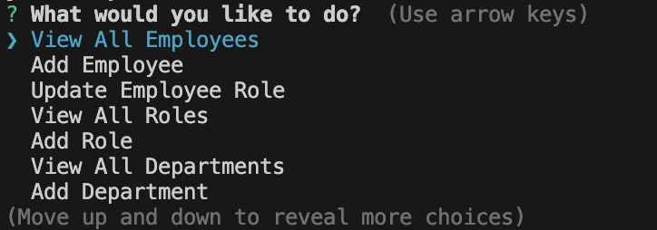
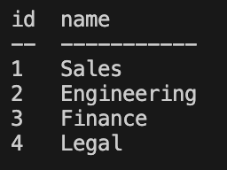
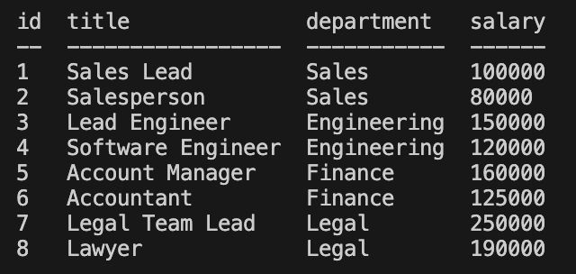
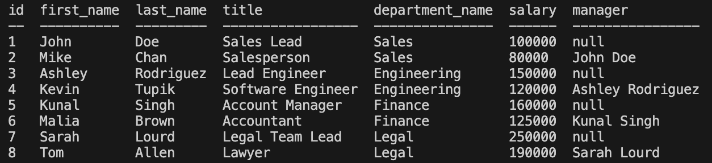
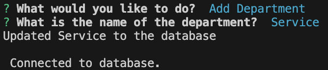
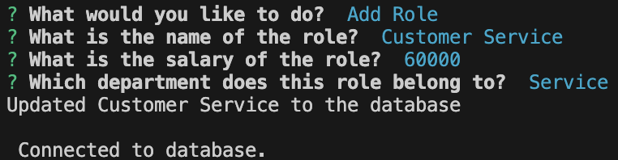
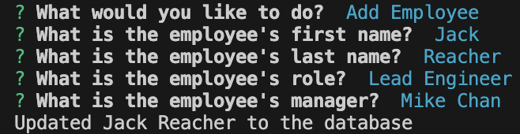

# Employee Tracker

A terminal application that can perform CRUD operations to an Employee database.

## Table of Contents

- [Description](#description)
- [Setup](#setup)
- [Usage](#usage)
- [Credits](#credits)
- [License](#license)
- [Video](#video)

## Description

What was your motivation?

- My motivation with this project is to create a cli content management system. So that anyone with a simple employee database can use this project to manage their employees easier. 

Why did you build this project?

- I built this project because I wanted to practice my newly acquired SQL skills. So that I get practice and can show what I learned.

What problem does it solve?

- This problem solves the need for a simple employee management system for a small company. 

What did you learn?

- I learned a little more on how promises work. The .then() I started using for sequential functions. I learned that you need the function to be async to use the .then. I learned how to use dynamic questions with a dynamic propmt. Many things I have learned. 

## Setup

Steps to follow to setup you environment:

1. If you haven't already, make sure node.js is installed on your computer. 

2. Also make sure you install mysql onto your computer. 

3. You will need your mysql password, so take note of your password somewhere.

4. Acquire project via github by either cloning or downloading.

5. Once acquired, then navigate to project in your IDE, terminal, or finder. 

6. Once at root of project, navigate into 'Main/db'. Update the .env file by adding your password after the = with no additional characters. To find the .env in the finder (Mac), on the db folder, do 'Command' + 'Shift' + '.' to view hidden files. On windows, do 'CTRL' + 'H'. If no password, continue on. 

7. You are done, make sure you are still in the db folder. 

## Usage

Run the command 'node index' in your terminal.

You should be prompted with this main menu. 

You can now select any of the various options. 

To view deparment, roles, employees in your database. Select any and press enter. 

To add deparment, role, or employee to your database. Select add department/role/employee and answer the following questions.

Success, you've added data to your database. 

Once you are ready to exit, select the exit option.

## Credits

https://www.w3schools.com/js/js_promise.asp
- Helped with promises. 

https://levelup.gitconnected.com/running-sql-queries-from-an-sql-file-in-a-nodejs-app-sqlite-a927f0e8a545
- Helped with reading an sql file to a string.

https://bertwagner.com/posts/joining-on-nulls/

- Helped with joining null values. 

## License

MIT License

Copyright (c) 2023 javieb5186

Permission is hereby granted, free of charge, to any person obtaining a copy
of this software and associated documentation files (the "Software"), to deal
in the Software without restriction, including without limitation the rights
to use, copy, modify, merge, publish, distribute, sublicense, and/or sell
copies of the Software, and to permit persons to whom the Software is
furnished to do so, subject to the following conditions:

The above copyright notice and this permission notice shall be included in all
copies or substantial portions of the Software.

THE SOFTWARE IS PROVIDED "AS IS", WITHOUT WARRANTY OF ANY KIND, EXPRESS OR
IMPLIED, INCLUDING BUT NOT LIMITED TO THE WARRANTIES OF MERCHANTABILITY,
FITNESS FOR A PARTICULAR PURPOSE AND NONINFRINGEMENT. IN NO EVENT SHALL THE
AUTHORS OR COPYRIGHT HOLDERS BE LIABLE FOR ANY CLAIM, DAMAGES OR OTHER
LIABILITY, WHETHER IN AN ACTION OF CONTRACT, TORT OR OTHERWISE, ARISING FROM,
OUT OF OR IN CONNECTION WITH THE SOFTWARE OR THE USE OR OTHER DEALINGS IN THE
SOFTWARE.

## Video

To see a quick video of how it works visually, check out this link.

https://drive.google.com/file/d/1lDlD_kPAMTJoapOhUg_LfyWY-Cv_x3-2/view 